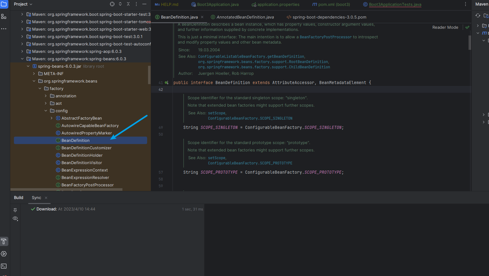
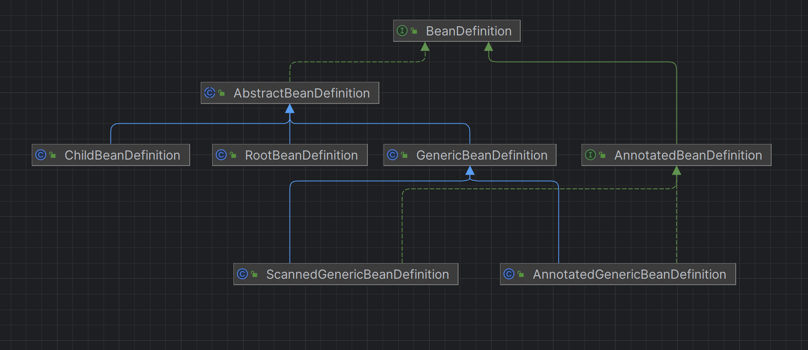
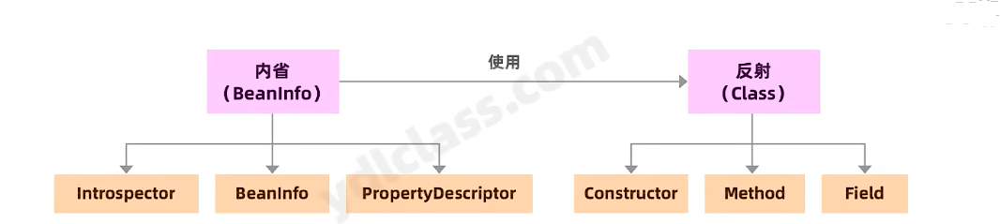

## 一.Bean的定义

### BeanDefinition

```text
A BeanDefinition describes a bean instance, which has property values, constructor argument values, and further information supplied by concrete implementations.
This is just a minimal interface: The main intention is to allow a BeanFactoryPostProcessor to introspect and modify property values and other bean metadata.
```

```text
BeanDefinition描述了一个bean实例，该实例具有属性值，构造函数参数值以及具体实现提供的更多信息。
这只是一个最小的接口: 主要目的是允许BeanFactoryPostProcessor内省和修改属性值和其他bean元数据。
```




类图






### GenericBeanDefinition

```text
GenericBeanDefinition is a one-stop shop for standard bean definition purposes. Like any bean definition, it allows for specifying a class plus optionally constructor argument values and property values. Additionally, deriving from a parent bean definition can be flexibly configured through the "parentName" property.
In general, use this GenericBeanDefinition class for the purpose of registering user-visible bean definitions (which a post-processor might operate on, potentially even reconfiguring the parent name). Use RootBeanDefinition / ChildBeanDefinition where parent/child relationships happen to be pre-determined.
```

```reStructuredText
GenericBeanDefinition是用于标准bean定义的一站式商店。像任何bean定义一样，它允许指定一个类以及可选的构造函数参数值和属性值。此外，可以通过 “parentName” 属性灵活地配置从父bean定义派生的内容。
通常，使用GenericBeanDefinition类来注册用户可见的bean定义 (后处理器可能会对其进行操作，甚至可能会重新配置父名称)。使用RootBeanDefinition/ChildBeanDefinition。
```


### RootBeanDefinition

```text
A root bean definition represents the merged bean definition that backs a specific bean in a Spring BeanFactory at runtime. It might have been created from multiple original bean definitions that inherit from each other, typically registered as GenericBeanDefinitions. A root bean definition is essentially the 'unified' bean definition view at runtime.
Root bean definitions may also be used for registering individual bean definitions in the configuration phase. However, since Spring 2.5, the preferred way to register bean definitions programmatically is the GenericBeanDefinition class. GenericBeanDefinition has the advantage that it allows to dynamically define parent dependencies, not 'hard-coding' the role as a root bean definition.
```

```text
根bean定义表示在运行时在Spring BeanFactory中支持特定bean的合并bean定义。它可能是由多个原始bean定义创建的，这些bean定义相互继承，通常注册为GenericBeanDefinitions。根bean定义本质上是运行时的 “统一” bean定义视图。
根bean定义也可以用于在配置阶段注册单个bean定义。但是，自Spring 2.5以来，以编程方式注册bean定义的首选方法是GenericBeanDefinition类。GenericBeanDefinition的优点是它允许动态定义父依赖关系，而不是将角色 “硬编码” 为根bean定义。
```


### ChildBeanDefinition

```text
Bean definition for beans which inherit settings from their parent. Child bean definitions have a fixed dependency on a parent bean definition.
A child bean definition will inherit constructor argument values, property values and method overrides from the parent, with the option to add new values. If init method, destroy method and/or static factory method are specified, they will override the corresponding parent settings. The remaining settings will always be taken from the child definition: depends on, autowire mode, dependency check, singleton, lazy init.
NOTE: Since Spring 2.5, the preferred way to register bean definitions programmatically is the GenericBeanDefinition class, which allows to dynamically define parent dependencies through the GenericBeanDefinition.setParentName method. This effectively supersedes the ChildBeanDefinition class for most use cases.
```

```text
从其父级继承设置的Bean定义。子bean定义对父bean定义具有固定的依赖关系。
子bean定义将从父级继承构造函数参数值，属性值和方法覆盖，并可以选择添加新值。如果指定了init方法，destroy方法和/或静态工厂方法，它们将覆盖相应的父设置。其余的设置将始终从子定义: 依赖，自动模式，依赖检查，单例，懒惰init。
注意: 自Spring 2.5以来，以编程方式注册bean定义的首选方法是GenericBeanDefinition类，它允许通过GenericBeanDefinition.setParentName方法动态定义父依赖项。这有效地取代了大多数用例的ChildBeanDefinition类。
```

## 二、BeanDefinitionRegistry(保存 Bean 定义的注册表)

```text
Interface for registries that hold bean definitions, for example RootBeanDefinition and ChildBeanDefinition instances. Typically implemented by BeanFactories that internally work with the AbstractBeanDefinition hierarchy.
This is the only interface in Spring's bean factory packages that encapsulates registration of bean definitions. The standard BeanFactory interfaces only cover access to a fully configured factory instance.
Spring's bean definition readers expect to work on an implementation of this interface. Known implementors within the Spring core are DefaultListableBeanFactory and GenericApplicationContext.
```

```text
保存 Bean 定义的注册表的接口，例如 RootBeanDefinition 和 ChildBeanDefinition 实例。通常由内部使用 AbstractBeanDefinition 层次结构的 BeanFactory 实现。
这是 Spring 的 Bean 工厂包中唯一封装 Bean 定义 注册 的接口。标准 BeanFactory 接口仅涵盖对 完全配置的工厂实例的访问。
Spring 的 bean 定义读者希望致力于此接口的实现。Spring 核心中的已知实现器是 DefaultListableBeanFactory 和 GenericApplicationContext。
```


实体类

```java
@Data
public class User {

    private String name;
    private String age;
}
@Data
public class Pet {

    private String name;

    private String age;
}
@Data
@EqualsAndHashCode(callSuper = true)
public class Cat extends  Pet{

    private String color;
}


public class ExpectConfig {

    @Bean
    public User getUser(){
        return new User();
    }
}

```


```java
    @Test
    void genericBeanDefinitionTest() {
        GenericBeanDefinition genericBeanDefinition = new GenericBeanDefinition();
        genericBeanDefinition.setBeanClassName("com.expect.boot3.entity.User");
        genericBeanDefinition.setScope(GenericBeanDefinition.SCOPE_SINGLETON);
        genericBeanDefinition.setInitMethodNames("init1","init2");
        MutablePropertyValues propertyValues = new MutablePropertyValues();
        propertyValues.addPropertyValue("name","33");
        propertyValues.addPropertyValue("age",16);
        genericBeanDefinition.setPropertyValues(propertyValues);
    }

    @Test
    void rootBeanDefinitionTest() {
        //定义简单注册表
        SimpleBeanDefinitionRegistry simpleBeanDefinitionRegistry = new SimpleBeanDefinitionRegistry();

        //添加父类RootBeanDefinition
        RootBeanDefinition rootBeanDefinition = new RootBeanDefinition();
        rootBeanDefinition.setBeanClassName("com.expect.boot3.entity.Pet");
        MutablePropertyValues propertyValues = new MutablePropertyValues();
        propertyValues.addPropertyValue("name","咪咪");
        propertyValues.addPropertyValue("age",2);
        rootBeanDefinition.setPropertyValues(propertyValues);
        simpleBeanDefinitionRegistry.registerBeanDefinition("pet",rootBeanDefinition);


        //添加子类ChildBeanDefinition
        ChildBeanDefinition childBeanDefinition = new ChildBeanDefinition("pet");
        childBeanDefinition.setBeanClassName("com.expect.boot3.entity.Cat");
        MutablePropertyValues cValues = new MutablePropertyValues();
        cValues.addPropertyValue("color","黑色");
        childBeanDefinition.setPropertyValues(cValues);

        simpleBeanDefinitionRegistry.registerBeanDefinition("cat",childBeanDefinition);
    }
```


## 三、加载BeanDefinition


### 1.XmlBeanDefinitionReader（读取xml配置文件）

```java
    @Test
    void xmlBeanDefinitionReaderTest() {
        BeanDefinitionRegistry beanDefinitionRegistry = new SimpleBeanDefinitionRegistry();

        XmlBeanDefinitionReader xmlBeanDefinitionReader = new XmlBeanDefinitionReader(beanDefinitionRegistry);
        xmlBeanDefinitionReader.loadBeanDefinitions("classpath:bean.xml");
        log.info("user:{}",beanDefinitionRegistry.getBeanDefinition("user").getBeanClassName());
        log.info("pet:{}",beanDefinitionRegistry.getBeanDefinition("pet").getBeanClassName());
        log.info("cat:{}",beanDefinitionRegistry.getBeanDefinition("cat").getBeanClassName());
    }
```

### 2.AnnotatedBeanDefinitionReader

```java
    @Test
    void annotatedBeanDefinitionReaderTest() {
        BeanDefinitionRegistry beanDefinitionRegistry = new SimpleBeanDefinitionRegistry();
        AnnotatedBeanDefinitionReader annotatedBeanDefinitionReader=new AnnotatedBeanDefinitionReader(beanDefinitionRegistry);
        annotatedBeanDefinitionReader.registerBean(Exception.class);
        String[] beanDefinitionNames = beanDefinitionRegistry.getBeanDefinitionNames();
        log.info(Arrays.toString(beanDefinitionNames));
    }
//并不能拿到@Bean注解注入的User
	@Test
    void annotatedBeanDefinitionReaderTest() {
        BeanDefinitionRegistry beanDefinitionRegistry = new SimpleBeanDefinitionRegistry();
        AnnotatedBeanDefinitionReader annotatedBeanDefinitionReader=new AnnotatedBeanDefinitionReader(beanDefinitionRegistry);
        annotatedBeanDefinitionReader.registerBean(User.class);
        String[] beanDefinitionNames = beanDefinitionRegistry.getBeanDefinitionNames();
        log.info(Arrays.toString(beanDefinitionNames));
    }
//这样可以拿到User
```

想要拿到@Bean注入的方法使用**ConfigurationClassBeanDefinitionReader** 但是**ConfigurationClassBeanDefinitionReader**并不是**public**修饰的，所以我们无法使用

### 3.ConfigurationClassBeanDefinitionReader(非public无法测试)


### 4.ClassPathBeanDefinitionScanner（扫包与@ComponentScan配合使用）


```java
    @Test
    void classPathBeanDefinitionScannerTest() {
        BeanDefinitionRegistry beanDefinitionRegistry = new SimpleBeanDefinitionRegistry();
        ClassPathBeanDefinitionScanner classPathBeanDefinitionScanner = new ClassPathBeanDefinitionScanner(beanDefinitionRegistry);
        classPathBeanDefinitionScanner.scan("com.expect.boot3");
        String[] beanDefinitionNames = beanDefinitionRegistry.getBeanDefinitionNames();
        log.info(Arrays.toString(beanDefinitionNames));
    }
```

### 简单了解scan方法(建议断点调试看一下)

注意ClassPathBeanDefinitionScanner.scan方法

```java
	/**
	 * Perform a scan within the specified base packages.
	 * @param basePackages the packages to check for annotated classes
	 * @return number of beans registered
	 */
	public int scan(String... basePackages) {
		int beanCountAtScanStart = this.registry.getBeanDefinitionCount();

		doScan(basePackages);

		// Register annotation config processors, if necessary.
		if (this.includeAnnotationConfig) {
			AnnotationConfigUtils.registerAnnotationConfigProcessors(this.registry);
		}

		return (this.registry.getBeanDefinitionCount() - beanCountAtScanStart);
	}
```

doScan方法

```java
	/**
	 * Perform a scan within the specified base packages,
	 * returning the registered bean definitions.
	 * <p>This method does <i>not</i> register an annotation config processor
	 * but rather leaves this up to the caller.
	 * @param basePackages the packages to check for annotated classes
	 * @return set of beans registered if any for tooling registration purposes (never {@code null})
	 */
	protected Set<BeanDefinitionHolder> doScan(String... basePackages) {
		Assert.notEmpty(basePackages, "At least one base package must be specified");
		Set<BeanDefinitionHolder> beanDefinitions = new LinkedHashSet<>();
		for (String basePackage : basePackages) {
			Set<BeanDefinition> candidates = findCandidateComponents(basePackage);
			for (BeanDefinition candidate : candidates) {
				ScopeMetadata scopeMetadata = this.scopeMetadataResolver.resolveScopeMetadata(candidate);
				candidate.setScope(scopeMetadata.getScopeName());
				String beanName = this.beanNameGenerator.generateBeanName(candidate, this.registry);
				if (candidate instanceof AbstractBeanDefinition) {
					postProcessBeanDefinition((AbstractBeanDefinition) candidate, beanName);
				}
				if (candidate instanceof AnnotatedBeanDefinition) {
					AnnotationConfigUtils.processCommonDefinitionAnnotations((AnnotatedBeanDefinition) candidate);
				}
				if (checkCandidate(beanName, candidate)) {
					BeanDefinitionHolder definitionHolder = new BeanDefinitionHolder(candidate, beanName);
					definitionHolder =
							AnnotationConfigUtils.applyScopedProxyMode(scopeMetadata, definitionHolder, this.registry);
					beanDefinitions.add(definitionHolder);
					registerBeanDefinition(definitionHolder, this.registry);
				}
			}
		}
		return beanDefinitions;
	}
```


findCandidateComponents方法

```java
	/**
	 * Scan the class path for candidate components.
	 * @param basePackage the package to check for annotated classes
	 * @return a corresponding Set of autodetected bean definitions
	 */
	public Set<BeanDefinition> findCandidateComponents(String basePackage) {
		if (this.componentsIndex != null && indexSupportsIncludeFilters()) {
			return addCandidateComponentsFromIndex(this.componentsIndex, basePackage);
		}
		else {
			return scanCandidateComponents(basePackage);
		}
	}
```

scanCandidateComponents方法

```java
	private Set<BeanDefinition> scanCandidateComponents(String basePackage) {
		Set<BeanDefinition> candidates = new LinkedHashSet<>();
		try {
			String packageSearchPath = ResourcePatternResolver.CLASSPATH_ALL_URL_PREFIX +
					resolveBasePackage(basePackage) + '/' + this.resourcePattern;
			Resource[] resources = getResourcePatternResolver().getResources(packageSearchPath);
			boolean traceEnabled = logger.isTraceEnabled();
			boolean debugEnabled = logger.isDebugEnabled();
			for (Resource resource : resources) {
				String filename = resource.getFilename();
				if (filename != null && filename.contains(ClassUtils.CGLIB_CLASS_SEPARATOR)) {
					// Ignore CGLIB-generated classes in the classpath
					continue;
				}
				if (traceEnabled) {
					logger.trace("Scanning " + resource);
				}
				try {
					MetadataReader metadataReader = getMetadataReaderFactory().getMetadataReader(resource);
					if (isCandidateComponent(metadataReader)) {
						ScannedGenericBeanDefinition sbd = new ScannedGenericBeanDefinition(metadataReader);
						sbd.setSource(resource);
						if (isCandidateComponent(sbd)) {
							if (debugEnabled) {
								logger.debug("Identified candidate component class: " + resource);
							}
							candidates.add(sbd);
						}
						else {
							if (debugEnabled) {
								logger.debug("Ignored because not a concrete top-level class: " + resource);
							}
						}
					}
					else {
						if (traceEnabled) {
							logger.trace("Ignored because not matching any filter: " + resource);
						}
					}
				}
				catch (FileNotFoundException ex) {
					if (traceEnabled) {
						logger.trace("Ignored non-readable " + resource + ": " + ex.getMessage());
					}
				}
				catch (Throwable ex) {
					throw new BeanDefinitionStoreException(
							"Failed to read candidate component class: " + resource, ex);
				}
			}
		}
		catch (IOException ex) {
			throw new BeanDefinitionStoreException("I/O failure during classpath scanning", ex);
		}
		return candidates;
	}
```

## 二.工具类

### 1.内省

在Java内省中，用到的基本上就是上述几个类。
内省api的一般的做法是 通过类Introspector的getBeanInfo方法来获取某个对象的BeanInfo信息，然后通过BeanInfo来获取
属性的描述器(PropertyDescriptor),通过这个属性描述器就可以获取某个属性对应的取值赋值方法,然后我们就可以通过反
射机制来调用这些方法，这就是内省机制。

```java
	@Test
    public void introspectorTest() throws IntrospectionException {
        BeanInfo beanInfo = Introspector.getBeanInfo(User.class, Object.class);
        PropertyDescriptor[] propertyDescriptors = beanInfo.getPropertyDescriptors();
        for (PropertyDescriptor propertyDescriptor : propertyDescriptors) {
            log.info("name:[{}]",propertyDescriptor.getName());
            log.info("type:[{}]",propertyDescriptor.getPropertyType());
            log.info("writeMethod:[{}]",propertyDescriptor.getWriteMethod());
            log.info("readMethod:[{}]",propertyDescriptor.getReadMethod());
        }
    }

    @Test
    public void introspector1Test() throws IntrospectionException, InvocationTargetException, IllegalAccessException {
        User user = new User();
        PropertyDescriptor propertyDescriptor=new PropertyDescriptor("age",User.class);
        Method writeMethod = propertyDescriptor.getWriteMethod();
        writeMethod.invoke(user,"13");
        log.info("user:[{}]",user);
        Method readMethod = propertyDescriptor.getReadMethod();
        Object age = readMethod.invoke(user);
        log.info("age:[{}]",age);
    }

```

### 2.更强的反射工具

在spring中，我们除了能看到内省相关的api,看到的更多的可能是反射api了，当然针对原生api的复杂性，spring同样进行了封
装,让其使用起来更简单。
spring给我们提供了强大的反射工具BeanWrapper,下边的例子展示 了该类如何配合BeanDefinition对其进行了实例化:


```java
 	@Test
    void beanWrapperTest() throws ClassNotFoundException {
        //获取BeanDefinition
        GenericBeanDefinition genericBeanDefinition = new GenericBeanDefinition();
        genericBeanDefinition.setBeanClassName("com.expect.boot3.entity.User");
        MutablePropertyValues propertyValues = new MutablePropertyValues();
        propertyValues.addPropertyValue("name","33");
        propertyValues.addPropertyValue("age",16);
        genericBeanDefinition.setPropertyValues(propertyValues);

        //实例化
        Class<?> aClass = Class.forName(genericBeanDefinition.getBeanClassName());
        BeanWrapper beanWrapper=new BeanWrapperImpl(aClass);
        beanWrapper.setPropertyValues(genericBeanDefinition.getPropertyValues());
        Object wrappedInstance = beanWrapper.getWrappedInstance();
        log.info("obj:[{}]",wrappedInstance);
    }

	//批量实例化Bean
 	@Test
    void beanWrapperBatchTest() throws ClassNotFoundException {
        BeanDefinitionRegistry beanDefinitionRegistry = new SimpleBeanDefinitionRegistry();
        ClassPathBeanDefinitionScanner classPathBeanDefinitionScanner = new ClassPathBeanDefinitionScanner(beanDefinitionRegistry);
        classPathBeanDefinitionScanner.scan("com.expect.boot3");
        for (String beanDefinitionName : beanDefinitionRegistry.getBeanDefinitionNames()) {
            BeanDefinition beanDefinition = beanDefinitionRegistry.getBeanDefinition(beanDefinitionName);
            //实例化
            Class<?> aClass = Class.forName(beanDefinition.getBeanClassName());
            BeanWrapper beanWrapper=new BeanWrapperImpl(aClass);
            beanWrapper.setPropertyValues(beanDefinition.getPropertyValues());
            Object wrappedInstance = beanWrapper.getWrappedInstance();
            log.info("obj:[{}]",wrappedInstance);
        }

    }
	//通过xml配置文件配置的bean会存在类型转换错误 string必须转换为对应类型才行
    @Test
    void beanWrapperBatch2Test() throws ClassNotFoundException {
        BeanDefinitionRegistry beanDefinitionRegistry = new SimpleBeanDefinitionRegistry();
        XmlBeanDefinitionReader xmlBeanDefinitionReader = new XmlBeanDefinitionReader(beanDefinitionRegistry);
        xmlBeanDefinitionReader.loadBeanDefinitions("classpath:bean.xml");
        for (String beanDefinitionName : beanDefinitionRegistry.getBeanDefinitionNames()) {
            BeanDefinition beanDefinition = beanDefinitionRegistry.getBeanDefinition(beanDefinitionName);
            //实例化
            Class<?> aClass = Class.forName(beanDefinition.getBeanClassName());
            BeanWrapper beanWrapper=new BeanWrapperImpl(aClass);
            beanWrapper.setPropertyValues(beanDefinition.getPropertyValues());
            Object wrappedInstance = beanWrapper.getWrappedInstance();
            log.info("obj:[{}]",wrappedInstance);
        }
    }

```

### 3.ResolvableType

该类可以封装Java类型，提供对超类类型、接口和泛型参数的访问，以及最终解析为类的能力,这是非常常见的一个类,他能及其
方便的简化对反射api的调用，该类在spring中的使用率非常高。
ResolvableType可以从字段、方法参数、方法返回类型或类中获得。这个类上的大多数方法本身都会返回一个ResolvableType,
以便于链式调用。
官方的案例如下:

```java
    private Map<Integer, List<String>> map=new HashMap<>();
    @Test
    public void resolvableTypeTest() throws NoSuchFieldException {
        ResolvableType resolvableType = ResolvableType.forField(getClass().getDeclaredField("map"));
        log.info("{}",resolvableType.getSuperType());
        log.info("{}",resolvableType.getType());
        log.info("{}",resolvableType.getGeneric(0));
        log.info("{}",resolvableType.getGeneric(1));
        log.info("{}",resolvableType.getGeneric(1).getGeneric(0));
    }
```


## 三、类型转化

我们从xmI中搜集到的所有数据都是[字符串]，但是实际的类中的成员变量可能是数字,数组，集合,或者是复杂的|用数据类
型，所以spring给我们提供了强大的转换服务(conversionService接口) 。

### 1、转换服务

ConversionService接口很简单，可以根据源类型和目标类型进行判断是否可以转换，并执行转换:

**ctrl+h**查看ConversionService的实现  我们使用DefaultConversionService测试

 

```java
 	@Test
    void beanWrapperBatch3Test() throws ClassNotFoundException {
        BeanDefinitionRegistry beanDefinitionRegistry = new SimpleBeanDefinitionRegistry();
        XmlBeanDefinitionReader xmlBeanDefinitionReader = new XmlBeanDefinitionReader(beanDefinitionRegistry);
        xmlBeanDefinitionReader.loadBeanDefinitions("classpath:bean.xml");
        for (String beanDefinitionName : beanDefinitionRegistry.getBeanDefinitionNames()) {
            BeanDefinition beanDefinition = beanDefinitionRegistry.getBeanDefinition(beanDefinitionName);
            //实例化
            Class<?> aClass = Class.forName(beanDefinition.getBeanClassName());
            BeanWrapper beanWrapper=new BeanWrapperImpl(aClass);
            beanWrapper.setConversionService(new DefaultConversionService());
            beanWrapper.setPropertyValues(beanDefinition.getPropertyValues());
            Object wrappedInstance = beanWrapper.getWrappedInstance();
            log.info("obj:[{}]",wrappedInstance);
        }
    }
```

之前报错的程序现在可以运行了


## 四、资源获取

Spring的[Resource] 接口位于[org.springframework.core.io] 包，他抽象了对资源的访问的能力。下面提供了
[Resource]接口的概述，Spring本身广 泛地使用了Resource接口，这个我们之前就接触过了。

```java
/*
 * Copyright 2002-2022 the original author or authors.
 *
 * Licensed under the Apache License, Version 2.0 (the "License");
 * you may not use this file except in compliance with the License.
 * You may obtain a copy of the License at
 *
 *      https://www.apache.org/licenses/LICENSE-2.0
 *
 * Unless required by applicable law or agreed to in writing, software
 * distributed under the License is distributed on an "AS IS" BASIS,
 * WITHOUT WARRANTIES OR CONDITIONS OF ANY KIND, either express or implied.
 * See the License for the specific language governing permissions and
 * limitations under the License.
 */

package org.springframework.core.io;

import java.io.File;
import java.io.IOException;
import java.io.InputStream;
import java.net.URI;
import java.net.URL;
import java.nio.channels.Channels;
import java.nio.channels.ReadableByteChannel;

import org.springframework.lang.Nullable;

/**
 * Interface for a resource descriptor that abstracts from the actual
 * type of underlying resource, such as a file or class path resource.
 *
 * <p>An InputStream can be opened for every resource if it exists in
 * physical form, but a URL or File handle can just be returned for
 * certain resources. The actual behavior is implementation-specific.
 *
 * @author Juergen Hoeller
 * @since 28.12.2003
 * @see #getInputStream()
 * @see #getURL()
 * @see #getURI()
 * @see #getFile()
 * @see WritableResource
 * @see ContextResource
 * @see UrlResource
 * @see FileUrlResource
 * @see FileSystemResource
 * @see ClassPathResource
 * @see ByteArrayResource
 * @see InputStreamResource
 */
public interface Resource extends InputStreamSource {

	/**
	 * Determine whether this resource actually exists in physical form.
	 * <p>This method performs a definitive existence check, whereas the
	 * existence of a {@code Resource} handle only guarantees a valid
	 * descriptor handle.
	 */
	boolean exists();

	/**
	 * Indicate whether non-empty contents of this resource can be read via
	 * {@link #getInputStream()}.
	 * <p>Will be {@code true} for typical resource descriptors that exist
	 * since it strictly implies {@link #exists()} semantics as of 5.1.
	 * Note that actual content reading may still fail when attempted.
	 * However, a value of {@code false} is a definitive indication
	 * that the resource content cannot be read.
	 * @see #getInputStream()
	 * @see #exists()
	 */
	default boolean isReadable() {
		return exists();
	}

	/**
	 * Indicate whether this resource represents a handle with an open stream.
	 * If {@code true}, the InputStream cannot be read multiple times,
	 * and must be read and closed to avoid resource leaks.
	 * <p>Will be {@code false} for typical resource descriptors.
	 */
	default boolean isOpen() {
		return false;
	}

	/**
	 * Determine whether this resource represents a file in a file system.
	 * <p>A value of {@code true} strongly suggests (but does not guarantee)
	 * that a {@link #getFile()} call will succeed.
	 * <p>This is conservatively {@code false} by default.
	 * @since 5.0
	 * @see #getFile()
	 */
	default boolean isFile() {
		return false;
	}

	/**
	 * Return a URL handle for this resource.
	 * @throws IOException if the resource cannot be resolved as URL,
	 * i.e. if the resource is not available as a descriptor
	 */
	URL getURL() throws IOException;

	/**
	 * Return a URI handle for this resource.
	 * @throws IOException if the resource cannot be resolved as URI,
	 * i.e. if the resource is not available as a descriptor
	 * @since 2.5
	 */
	URI getURI() throws IOException;

	/**
	 * Return a File handle for this resource.
	 * @throws java.io.FileNotFoundException if the resource cannot be resolved as
	 * absolute file path, i.e. if the resource is not available in a file system
	 * @throws IOException in case of general resolution/reading failures
	 * @see #getInputStream()
	 */
	File getFile() throws IOException;

	/**
	 * Return a {@link ReadableByteChannel}.
	 * <p>It is expected that each call creates a <i>fresh</i> channel.
	 * <p>The default implementation returns {@link Channels#newChannel(InputStream)}
	 * with the result of {@link #getInputStream()}.
	 * @return the byte channel for the underlying resource (must not be {@code null})
	 * @throws java.io.FileNotFoundException if the underlying resource doesn't exist
	 * @throws IOException if the content channel could not be opened
	 * @since 5.0
	 * @see #getInputStream()
	 */
	default ReadableByteChannel readableChannel() throws IOException {
		return Channels.newChannel(getInputStream());
	}

	/**
	 * Determine the content length for this resource.
	 * @throws IOException if the resource cannot be resolved
	 * (in the file system or as some other known physical resource type)
	 */
	long contentLength() throws IOException;

	/**
	 * Determine the last-modified timestamp for this resource.
	 * @throws IOException if the resource cannot be resolved
	 * (in the file system or as some other known physical resource type)
	 */
	long lastModified() throws IOException;

	/**
	 * Create a resource relative to this resource.
	 * @param relativePath the relative path (relative to this resource)
	 * @return the resource handle for the relative resource
	 * @throws IOException if the relative resource cannot be determined
	 */
	Resource createRelative(String relativePath) throws IOException;

	/**
	 * Determine the filename for this resource &mdash; typically the last
	 * part of the path &mdash; for example, {@code "myfile.txt"}.
	 * <p>Returns {@code null} if this type of resource does not
	 * have a filename.
	 * <p>Implementations are encouraged to return the filename unencoded.
	 */
	@Nullable
	String getFilename();

	/**
	 * Return a description for this resource,
	 * to be used for error output when working with the resource.
	 * <p>Implementations are also encouraged to return this value
	 * from their {@code toString} method.
	 * @see Object#toString()
	 */
	String getDescription();

}

```

1、内置的Resource的实现
Spring包含了几个内置的Resource实现，如下所际:
●UrlResource: UrlResource包装 了java.net.URL，可以用来访问任何需要通过URL访问的对象，例如文件、HTTPS目标、 FTP
目标等。所有URL都用一 个标准化的字符串表示， 这样就可以使用适当的标准化前缀来表示不同类型的URL。这包括用于访问
文件系统路径的" file: ',用于通过https协议访问资源的" https:',用于通过ftp访问资源的" ftp:等。
●ClassPathResource: 该类表示应该从[类路径]中获取的资源。它使用线程 上下文类装入器给定的类装入器或给定的类装
入资源。
●FileSystemResource: 这是面向java.io的Resource实现，可以简单的实现对系统文件的操作。
●InputStreamResource: 给定的InputStream的Resource实现。 只有 当没有特定的资源实现适用时，才应该使用它。
●ByteArrayResource: 这是一个给定字节数组的资源实现。

#### 加载url资源

```java
    @Test
    void UrlResourceTest() throws IOException {
        Resource urlResource = new UrlResource("https://images.liqucn.com/img/h22/h83/img_localize_f2a2a76aa032509dbe143b7faedbc14b_500x375.png");
        InputStream in = urlResource.getInputStream();

        File file = new File("D:\\temp\\a.png");
        OutputStream out = new FileOutputStream(file);

        byte[] buffer = new byte[1024];
        int length;
        while ((length = in.read(buffer)) > 0) {
            out.write(buffer, 0, length);
        }

        in.close();
        out.close();
    }
```


#### 加载ClassPath资源

```java
 @Test
    void classPathResourceTest() throws IOException {
        Resource urlResource = new ClassPathResource("bean.xml");
        InputStream in = urlResource.getInputStream();

        byte[] buffer = new byte[1024];
        int length;
        while ((length = in.read(buffer)) > 0) {
            System.out.print(new String(buffer,0,length));
        }

        in.close();
    }
```

#### 根据资源类型自动匹配

```java
 @Test
    void pathMatchingResourcePatternResolverTest() throws IOException {
        PathMatchingResourcePatternResolver resourceLoader = new PathMatchingResourcePatternResolver();
        Resource httpResource = resourceLoader.getResource("https://images.liqucn.com/img/h22/h83/img_localize_f2a2a76aa032509dbe143b7faedbc14b_500x375.png");
        Resource classpathResource = resourceLoader.getResource("classpath:bean.xml");
        Resource fileResource = resourceLoader.getResource("file://D:/b.png");
        Resource[] resources = resourceLoader.getResources("classpath*:META-INF/spring.factories");
        for (Resource resource : resources) {
            System.out.println(resource.getURI());
        }
    }

```

## 五、环境抽象

spring提供了Environment接口，是一个对环境的抽象,集成在容器中,它模拟了应用程序环境的两个关键方面，分别是profiles
和properties。
●-个profile是一 个给定名字的，在[逻辑上分了组]的beanDifination配置， 只有在给定的profile是激活的情况下才向容器注
册。
●properties在几乎所有的应用程序中都扮演着重要的角色，他就是一 大堆的key-value的集合, 他可能源自各种来源:属性文
件、JVM系统属性、系统环境变量、JNDI、 servlet 上下文参数、特定的[Properties] 对象、"Map"对象等等。与属性相关的
Envi ronment对象的作用是为用户提供一个方便的服务接口， 用于配置属性源并从那里解析属性。
1、porperties
Spring中的环境对象提供了对[属性]的搜索操作，我们看一下 下边的例子:

```java
    @Test
    void environmentTest() {
        ApplicationContext applicationContext = new GenericApplicationContext();
        Environment environment = applicationContext.getEnvironment();
        boolean javaHome = environment.containsProperty("JAVA_HOME");
        if (javaHome) {
            log.info("JAVA_HOME:{}", environment.getProperty("JAVA_HOME"));
        } else {
            log.info("没有");
        }

    }
```


